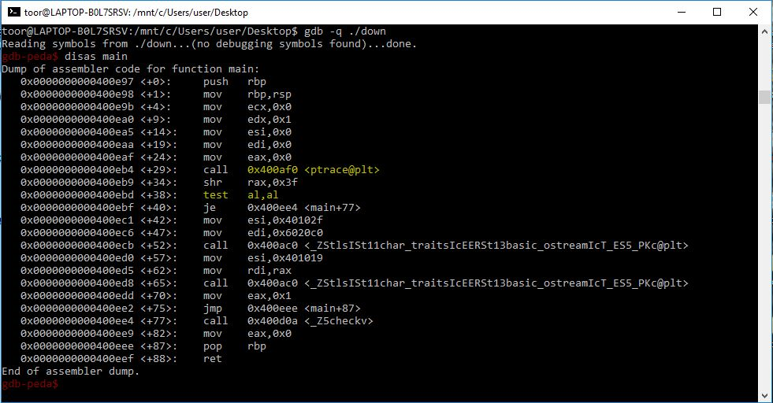
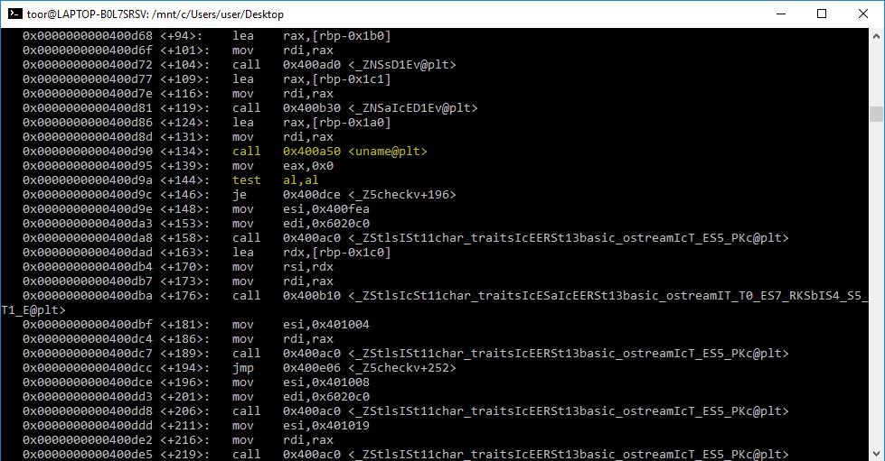
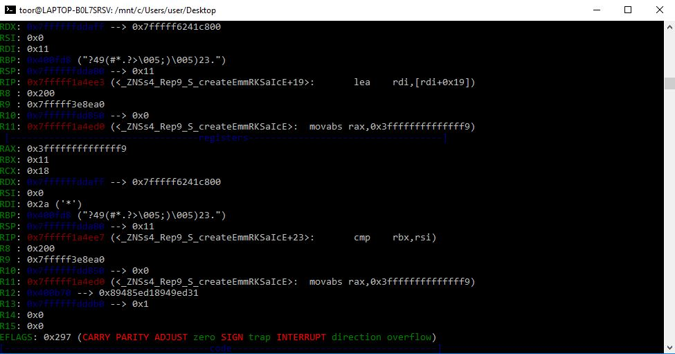
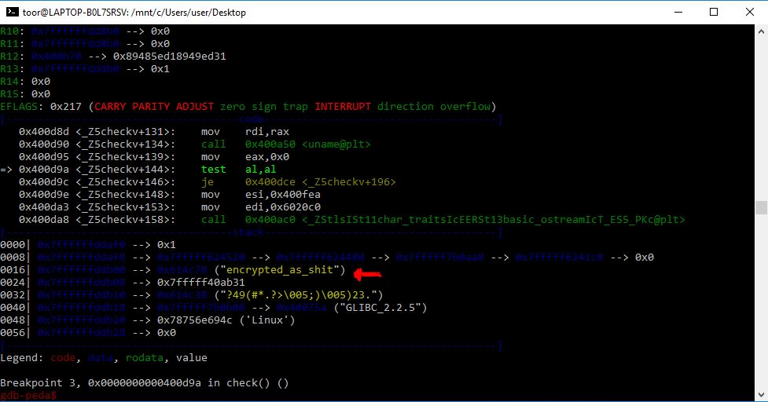

#RedEye CTF 2017 : Stupid Reverse 

* **Category**: Reverse  
* **Author**: Faid Mohammed Amine
* **Contact**: hello@faidamine.pw
* **Description**: 

$ gdb -q ./down

gdb-peda$ disas main

gdb-peda$ b*0x0000000000400eb4
gdb-peda$ disas check

gdb-peda$ b*0x0000000000400d9a
gdb-peda$ r

gdb-peda$ s
gdb-peda$ set $rax=1
gdb-peda$ c

and you get the flag 

# Write-up 

(TODO)

# Other write-ups and resources

